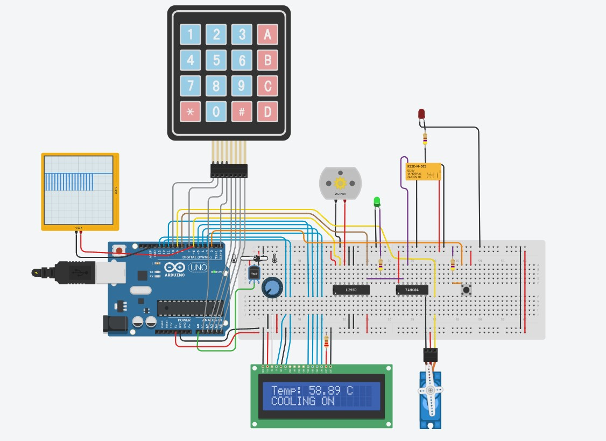

##1. Smart home IoT project

In this application main the focus was to simulate a smart home
IoT solution using a microcontroller, namely a ATmega328P incorporated 
in a Arduino Uno development board.

To simulate the functionalities that were implemented the tinkercad simulation environment was used.
The simulation design can be seen in the following image:

###1.1 Locking system
The first functionality of the application is to
open a door to a user house to achieve that a keypad
is used to obtain the password if the password is
correct the servo-motor simulates a door being opened.

###1.2 Temperature control system
If the temperature measured by the sensor is below the reference a warming system is simulated
by coupling a relay that is supposed to turn on
a warming element. Otherwise if the temperature is above the set-point then a cooling device is
simulated by turning on a dc motor with is controller with a PWM signal
from the microcontroller.

###1.3 Interactive LCD display
To help the user interact with the system useful details are displayed on
the LCD display like the temperature measured and the status of the temperature control
system. When the user tries to open or close the door he will know if the password was correct
or not and the action that follows.

## 2. Joystick
This application was implemented on a ATmega328P microcontroller
incorporated in a Arduino Uno development board.

All the functionalities were implemented using the data sheet of the microcontroller and with operations on it`s registers. A bare metal approach.

A servo-motor is controller by the movement of the joystick, this was achieved by reading the analog
value using the built in analog to digital converter then based in that the
servo-motor was moving close related to that value being controller with a PWM signal generated from the microcontroller. 
